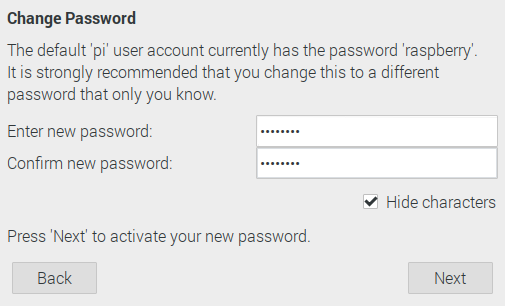

# マトリクスLEDパネルWebシステムセットアップ解説  
Raspberry PiにLEDマトリクスLEDパネルを制御するWebシステムを構築する手順を記す。  
## 必要機材  
- Raspberry Pi 3 Model B Rev 1.2
- 16x32LEDパネル x3
- パラレルケーブル x3
- LEDパネル用電源ケーブル
- microSDカード 16GB
- RGB Matrix HAT+RTC
- HAT用電源
- Raspberry Pi用電源
- USBマウス
- USBキーボード
- HDMIケーブル
- ディスプレイ
- LANケーブル
- インターネット環境
- Webブラウザの動くPC

## Raspberry Pi OSのインストール
1. Raspberry Pi Imagerのインストール  
Raspberry PiにOSをインストールする。  
OSをSDカードに書き込むためにRaspberry Pi Imagerを使用する。  
https://www.raspberrypi.org/software/にアクセスして、Install Raspberry Pi OS using Raspberry Pi Imagerの章から、Download for <使用しているOS名>をクリックして、Raspberry Pi Imagerをダウンロードする。  
以下図Xは上記URLの画面である。  
  

2. Raspberry Pi Imagerのインストール  
ダウンロードしたimager_1.5.exeを実行する。  
インストーラに従ってインストールする。  
インストール完了後、起動すると以下の図Xのような画面が出現する。  
  

3. Raspberry Pi OSの書き込み  
PCにmicroSDカードを挿入する。  
Raspberry Pi ImagerのOperating System以下のCHOOSE OSをクリックすると図Xのような画面が現れるので、OSタイプを選択する。  
  
今回はRaspberry Pi OS (32-bit)を選択する。  
次にSD Card以下のCHOOSE SD CARDをクリックして出現する以下図Xの画面から、インストール先のSDカードを選択する。  
  
ここまで選択が完了したら、WRITEボタンを押して、以下の図XのようにSDカード内のデータが削除される警告に承諾するならば、YESを押してOSを書き込む。  
  
SDカードへの書き込みが終わったら、以下の図Xのように終了の旨と、SDカードを取り外してよいメッセージが出るので、CONTINUEを押してSDカードを取り外す。  

4. Raspberry Pi OSのセットアップ  
Raspberry Piに3で作成したSDカードを装着する。  
Raspberry PiにディスプレイとUSBマウス、USBキーボード、LANケーブルを接続して、microUSBから電源を取り、起動する。  
このときまだHATは接続しない。  
電源投入後最初に以下の図Xのような画面が現れる。
  
Nextを押して設定を進めていく。  
Set Countryでは、CountryはJapan、LanguageはJapanese、TimezoneはTokyoを選択し、必要に応じてUse English LanguageやUse US keyboardにチェックを入れる。
  
次のChange Passwordでは、デフォルトユーザのpiにパスワードを設定する。  
デフォルトではraspberryが設定されているが、脆弱なので任意のパスワードを設定する。設定できたらNextを押す。  
  
Set Up Screenでは必要に応じてチェックを入れてNextを押す。  
  
Wi-Fiに接続する場合はSelect WiFi Netoworkで接続するSSIDを選択する。  
  
今回はSkipを選択する。  
Update Softwareではシステムのアップデートを行うのでNextを選択する。  
  
Setup Completeが出たらGUIでの設定は完了である。  
Doneを押してウィンドウを閉じる。  

ここからはCUIで設定を進めていく。  ツールバーのターミナルのアイコンをクリックして、ターミナルを開く。  
1. IPアドレスの固定  
ローカルIPアドレスを固定する。  
セットアップの際は接続しているネットワークに合わせて設定されたい。  
まず、現在のIPアドレスを確認するために`$ ifconfig`を実行する。  
実行すると以下のような結果が出力される。  
**ここにifconfig.txtの内容を挿入する**  
この結果のeth0部分のinet、及びnetmaskの部分を記憶して次の手順に進む。  
IPアドレスの固定を行うために`/etc/dhcpcd.conf`を編集する。  
viで編集する場合は次のコマンドで行う。  
`$ sudo vi /etc/dhcpcd.conf`  
ここからはviの操作に則って解説していく。  
ファイルを開いたら、Gを押してファイルの末尾に移動する。  
oを押して、ファイル末尾に次の内容を記述する。  
```
interface eth0
static ip_address=172.19.210.25/16
static routers=172.19.1.254
static domain_name_servers=8.8.8.8
```
記述できたらC-cを押して入力モードを解除する。  
ZZを押して保存してviを終了する。  
`$ sudo reboot`でRaspberry Piを再起動してネットワークが繋がるか検証する。  
検証の方法は`$ ping google.com`やWebブラウザで任意のWebサイトにアクセスするなどの方法で行う。  
IPアドレスが固定できているか確認するために、`$ ifconfig`を実行する。  
以下のように出力が変わっていたらIPアドレスの固定に成功している。  
**ここにifconfig_static.txtの内容を挿入する**  

2. SSHの設定  
Raspberry PiにSSHサーバを建てて、以後セットアップはすべてクライアントから行えるようにする。  
- Raspberry Pi側の操作  
画面左上のRaspberry Piアイコンをクリックし、メニューを展開した先の、設定>Raspberry Piの設定を選択する。  
Raspberry Piの設定のインターフェイスタブを選択し、SSHを有効にする。  
SSHを有効に設定した画面が以下の図Xである。  
  
有効にしたらOKを押してウィンドウを閉じる。  
- クライアント側の操作  
クライアントはWindows、macOS、LinuxなどSSHが使える環境であれば何でも良い。  
**ここにWindowsでSSHクライアントを使えるようにする手順を書く**  
ここでは、WSL上のUbuntuからSSH接続する手順を示す。  
WSLのターミナルを開き、`$ ssh pi@172.19.210.25`を実行してRaspberry Piに接続する。  
Are you sure you want to continue connectingと尋ねられるので、yesと入力する。  
パスワードを尋ねられるので、設定したパスワードを入力する。  
pi@raspberrypiのプロンプトが出て接続が完了する。  
以後Raspberry Piの設定はSSHを介して行うのでRaspberry Piからディスプレイやキーボード、マウスは外しても構わない。  

3. led-matrixの環境構築  
ここからようやくLEDパネルのシステムを構築していく。  
SSH接続したRaspberry Piのターミナルで作業する。 
0. aptのアップデート  
`$ sudo apt update`でaptをアップデートする。  
1. Node.jsのインストール  
Raspberry PiのNode.jsをインストールする。  
`$ sudo apt install -y nodejs npm`を実行し、Node.jsとnpmをインストールする。  
`$ node -v`を実行し、Node.jsのバージョンを確認する。  
令和3年2月18日時点では、`v10.23.1`が標準でインストールされる。  
v10系も使用しているプラグインはサポートされているが、動作保証は出来ないのでv12.18.3を推奨する。  
Node.jsのバージョンを切り替えるためにNode.jsのバージョン管理ソフト、nをインストールする。  
`$ sudo npm cache clean`でnpmをキャッシュを削除する。  
`$ sudo npm install npm n -g`でnをインストールする。  
`$ sudo n 12.18.3`でv12.18.3のNode.jsをインストールする。  
このままではsudoしないとnのバージョン変更が適用されないので、`$ vi ~/.bashrc`を実行して、末尾に以下を追記する。  
```
export N_PREFIX=$HOME/.n
export PATH=$N_PREFIX/bin:$PATH
```
以上の作業を終えて、Node.jsのバージョンが変更されているか確認する。  
`$ node -v`を実行して、`v12.18.3`が表示されたらバージョン変更が完了している。  
`$ cd`を実行して、ホームディレクトリに戻る。  
2. led-matrixリポジトリのダウンロード  
GitHubからled-matrixのリポジトリをダウンロードする。  
ターミナルで`$ cd ~`を実行し、ホームディレクトリに移動した後、`$ git clone https://github.com/xiexxa/led-matrix.git`を実行してホームディレクトリ直下にプロジェクトディレクトリを保存する。  

3. MySQLのインストール  
WebアプリケーションにMySQLを使用している。これをインストールする。  
`$ sudo apt install mariadb-server`  
インストールが完了したら、MySQLのセットアップを行う。  
`$ sudo /usr/bin/mysql_secure_installation`を実行し、セットアップウィザードに従う。  
ENter current password for root (enter for none)と表示されるので、Enterで次へ進む。  
Set root password?と聞かれるのでyでRootのパスワードを設定する。  
MySQLのrootパスワードを設定する。  
Remove anonymous users?と聞かれるので、yで匿名ユーザを削除する。  
Disallow root login remotely?と聞かれるので、yでEnterする。  
Remove test database and access to it?と聞かれるので、yでEnterする。  
Reload privilege tables now?と聞かれるのでyでEnterする。  
以上でMySQLの初期設定が完了する。  
次にWebアプリケーションからアクセスするMySQLのユーザを作成する。  
`$ sudo mariadb`でmariaDBにログインする。  
`create user eisuke identified by 'password'`を実行し、eisukeユーザをパスワードをpasswordとして作成する。  
`exit`でログアウトする。  
次に作成したユーザでログインできるか確認する。 
`$ mariadb -u eisuke -p`を実行し、パスワードはユーザ作成時に設定したパスワードを入力する。  
ログインできることが確認できたら、`exit`でログアウトする。  
Webアプリケーション用のデータベースとテーブルを作成する。  
`$ sudo mariadb`でDBにログインし、`create database testdb;`を実行する。  
`grant all on *.* to 'eisuke'@'%';`を実行してeisukeユーザにすべての権限を付与する。  
`$ cd ~/led-matrix/sql`でSQLファイルのあるディレクトリに移動し、`$ mariadb testdb -u eisuke -p < init.sql`を実行してSQLファイルを元にDBを構築する。  
DBの構成が正しく出来ているか確認するために、mariaDBにログインする。  
`$ maridb -u eisuke -p`でログインしたあと、`use testdb;`でDBをtestdbに変更する。  
`show tables;`で作成済みテーブル一覧を確認し、以下のようになっていればDBの設定は完了している。  
**ここにsql.txtの内容を書く**  

3. led-matrixの依存プラグインインストール  
led-matrixは複数のNode.jsモジュールに依存して動作している。  
これらの依存関係を解決するために、次のコマンドを実行する。  
`$ cd led-matrix`を実行して、led-matrixディレクトリに移動する。  
`$ sudo npm install`で依存モジュールを一括インストールする。  
この際、chromedriverが32bitOSに対応していない等のエラーが発生する場合は以下のコマンドを実行してエラーを解消する。  
`$ rm -rf node_modules/; rm package-lock.json`  
削除が完了したら、再度`$ sudo npm install`を実行する。  
easybotics-rpi-rgb-led-matrixがないといわれるので、`$ npm i easybotics-rpi-rgb-led-matrix`でインストールする。  
インストールが完了したら、`$ node server.js`でバックエンドのスクリプトを実行する。  

4. フロントエンドのビルド  
フロントエンド機能のスクリプトをビルドする必要がある。  
`$ cd ~/led-matrix`でled-matrixに移動した後、`$ npm run build`を実行する。  

5. リバースプロキシの設定  
この状態では3000番ポートでしかWebシステムが利用できないので、リバースプロキシを設定して80番ポートへのアクセスを3000番へ飛ばすようにする。  
Apacheのリバースプロキシ機能を使うのでApacheをインストールする。  
`$ sudo apt install apache2`  
Apacheのプロキシ関係のモジュールを有効にする。  
```
$ sudo a2enmod proxy
$ sudo a2enmod proxy_http
```
プロキシの設定をApacheの設定ファイルに追記する。  
`$ sudo vi /etc/apache2/apache2.conf`  
以下の内容を末尾に追記する。  
```
ProxyRequests Off
ProxyPass / http://localhost:3000/
ProxyPassReverse / http://localhost/
```
ZZで保存して終了する。  
`$ sudo service apache2 restart`でApacheを再起動する。  
再起動後、http://<Raspberry PiのIPアドレス>/にアクセスすると、led-matrixのトップが表示される。

5. 配線  
ハードウェアの配線の方法について解説する。  
最終的に、以下の図16のように配線する。  
  
はじめから手順を追って解説していく。  
  1. LEDパネルをフラットケーブルで接続する。  
  LEDパネルのINとOUTをフラットケーブルで接続する。  
  2箇所接続して、これを3枚のLEDパネルが数珠つなぎになるように配線する。  
  端子は切り欠きとツメが対応する向きにして差し込む。  
  2. LEDパネル用電源ケーブルを接続する。  
  LEDパネルに4pinコネクタの電源ケーブルを接続する。  
  ツメがコネクタに付いているので、LEDパネル裏面中央部の4pin端子に接続する。  
  3枚のパネルでそれぞれ行う。  
  3. HATにフラットケーブルと電源を接続する。  
  まずHATに電源を接続する。  
  HATのOutput 5Vの部分に2で接続した電源ケーブルの一対を+は赤、-は黒のケーブルに対応するように接続する。  
  接続した図が以下の図Xである。  
    
  次にフラットケーブルをHATに接続する。HAT中央のHUB75の端子にフラットケーブルを接続し、一対は1で接続したLEDパネルのIN端子に接続する。  
  4. HATをRaspberry Piに接続する。  
  Raspberry Piに重ねるように、HATを載せて、Raspberry PiのGPIOピンに接続する。  
  5. ACアダプタを接続する。  
  Raspberry PiのmicroUSB端子にUSB ACアダプタの電源を、HATの電源端子にACアダプタの電源を差し込み通電する。  
  以上で配線は完了する。  

6. 使用方法  

7. トラブルシューティング  

10. 参考文献  
Node のバージョン管理ツール n の使い方、 Naotsugu、[https://blog1.mammb.com/entry/2019/11/26/090000#n-%E3%81%AE%E3%82%A4%E3%83%B3%E3%82%B9%E3%83%88%E3%83%BC%E3%83%AB]。 

【本番リリース】Node.jsサーバ接続方法【リバースプロキシ】、 タクマ、https://suwaru.tokyo/%E3%80%90%E6%9C%AC%E7%95%AA%E3%83%AA%E3%83%AA%E3%83%BC%E3%82%B9%E3%80%91node-js%E3%82%B5%E3%83%BC%E3%83%90%E6%8E%A5%E7%B6%9A%E6%96%B9%E6%B3%95%E3%80%90%E3%83%AA%E3%83%90%E3%83%BC%E3%82%B9%E3%83%97/。

LEDドットマトリクスパネル HUB75規格について調べてみた、onokatio、https://qiita.com/onokatio/items/1b99ae9475b6a9fc2f15。

【Node.js】foreverコマンドの基本的な使い方まとめ, taneyats, https://www.taneyats.com/entry/nodejs-forever.

Apache2.4でリバースプロキシ、tukiyo3、https://qiita.com/tukiyo3/items/d49cec3b63f231202602。