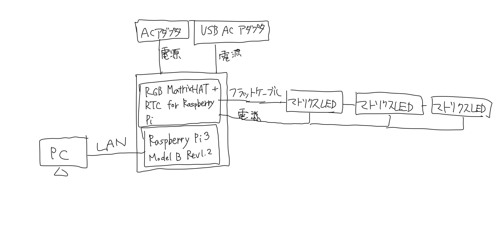
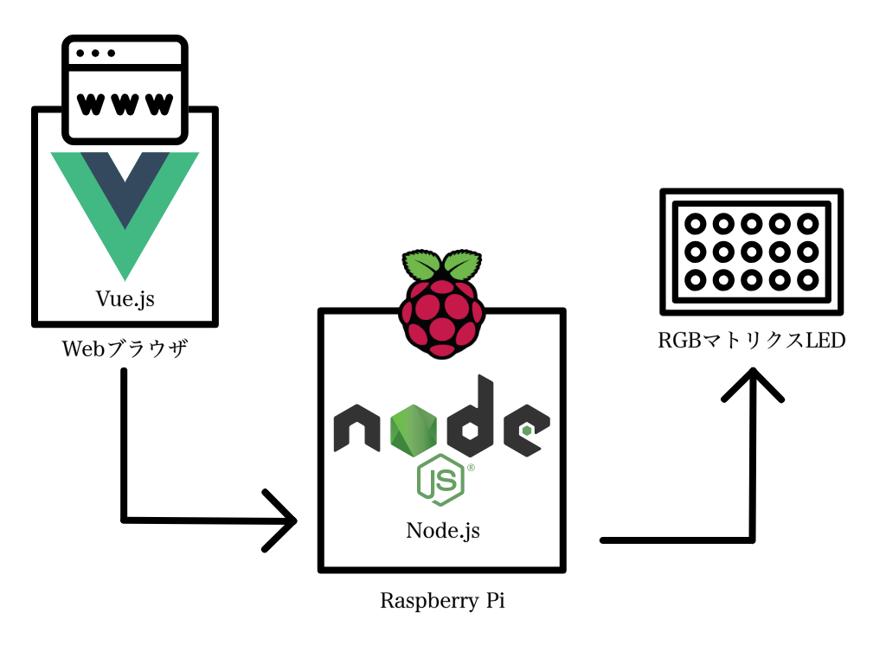
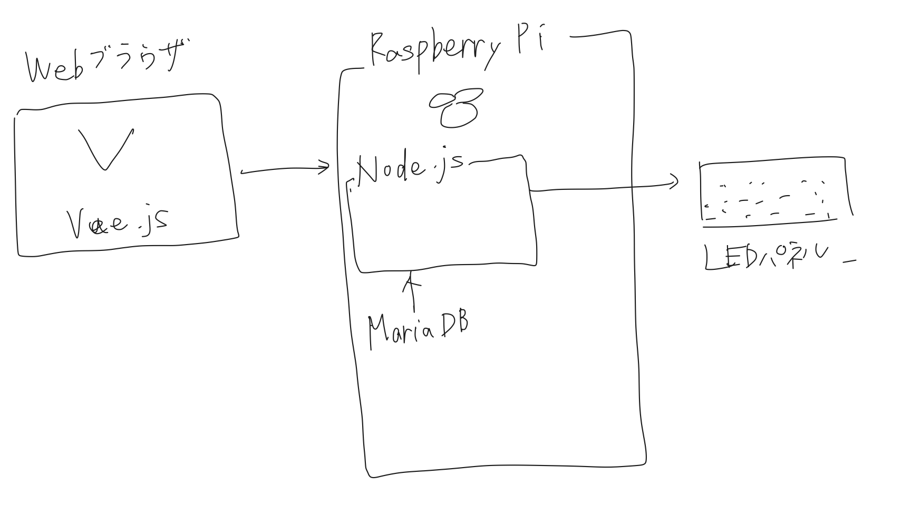
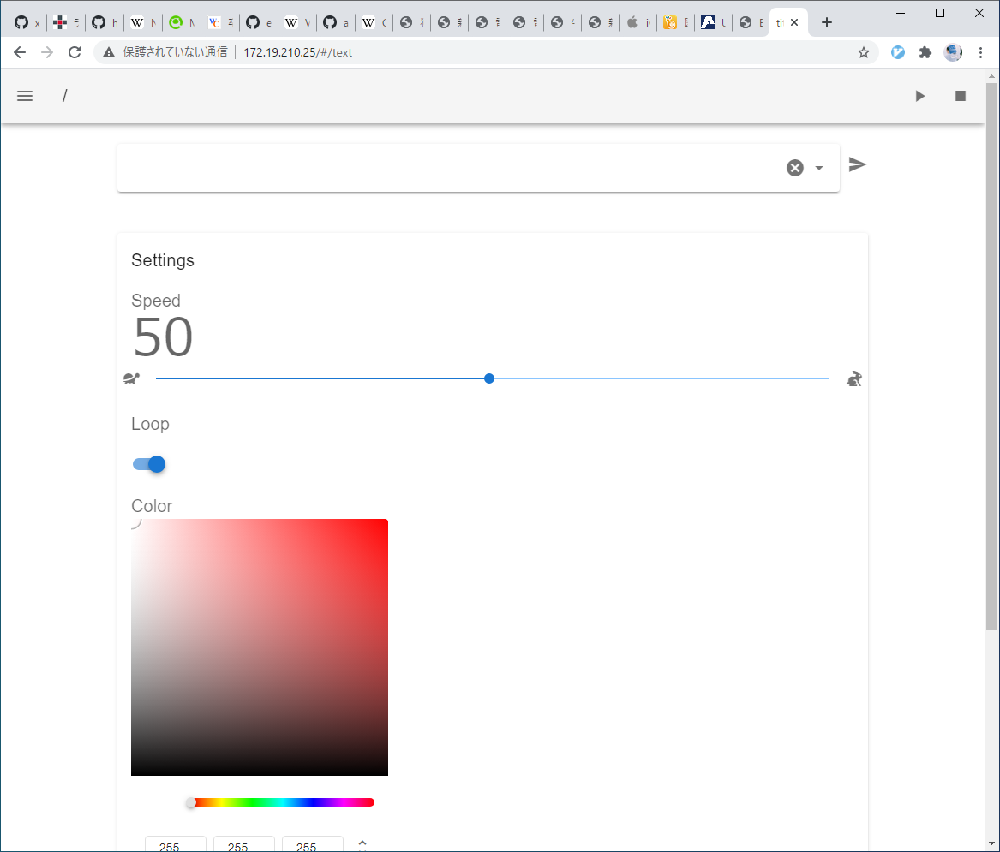
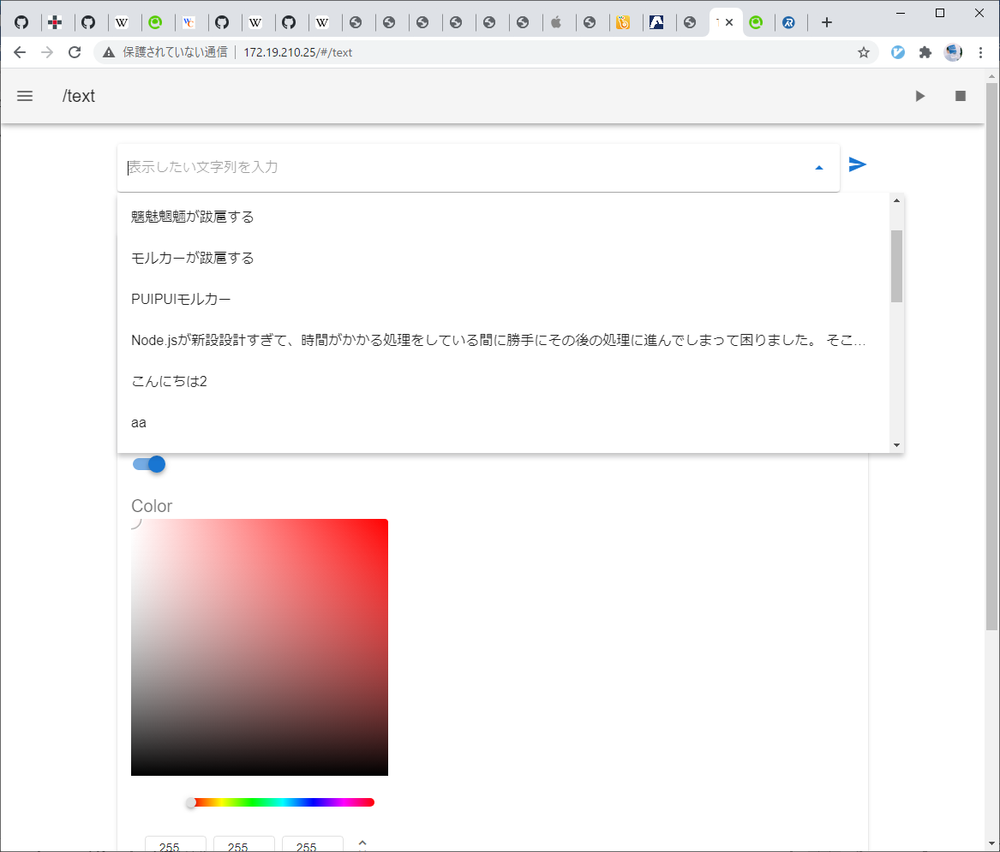
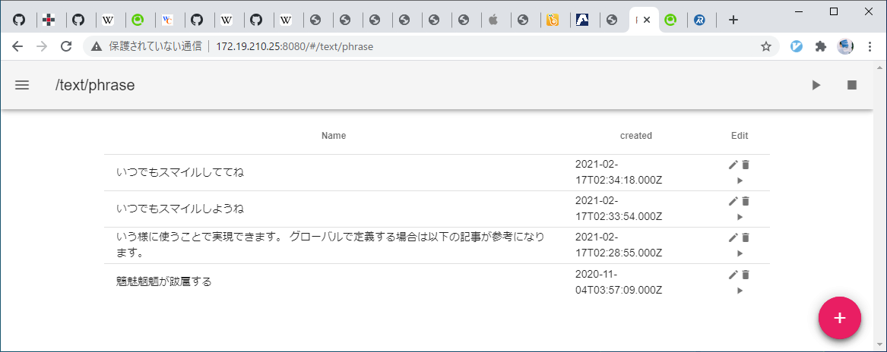
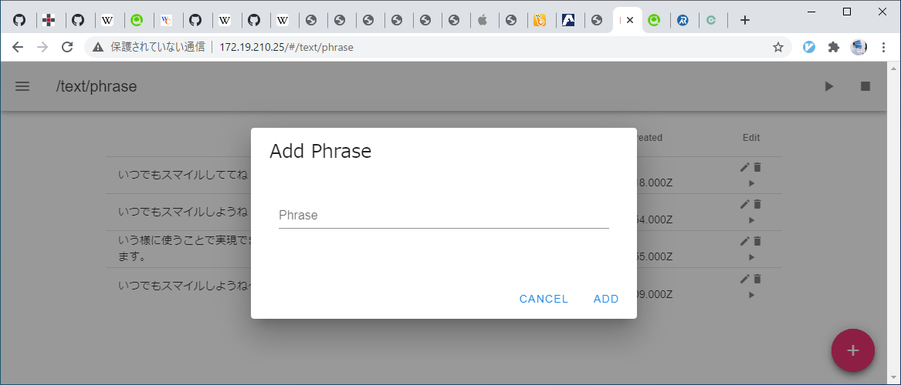
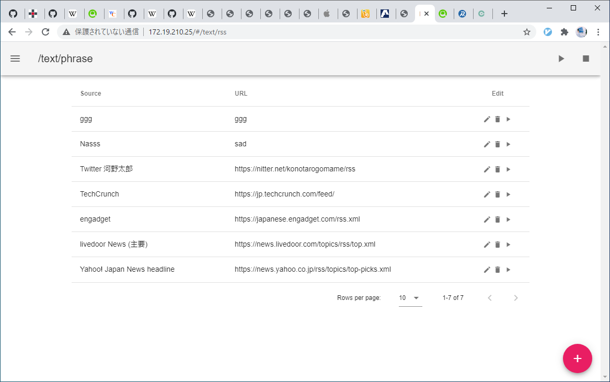
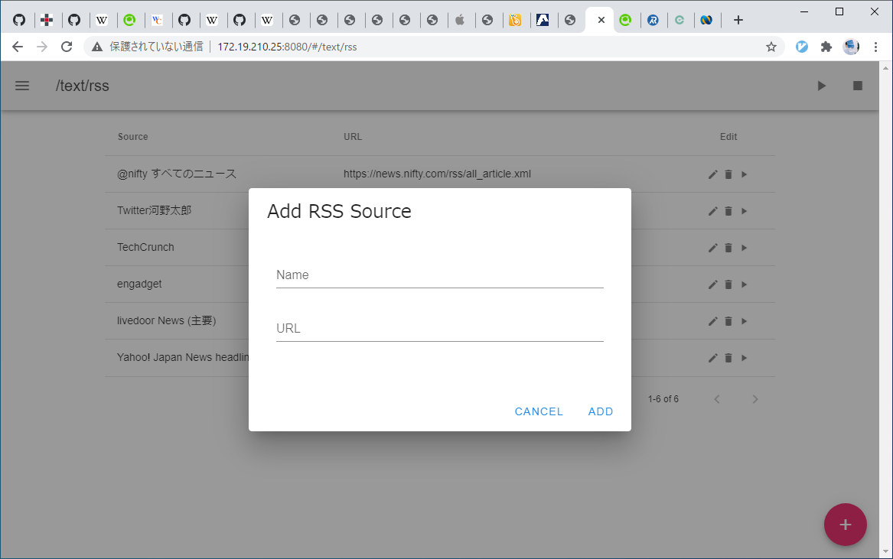

# 卒業研究報告書
## 研究題目: Node.jsによるRGBマトリクスLED制御システム開発

1. まえがき

本研究はRGBマトリクスLEDパネル(以下、LEDパネル)をWebブラウザから制御するシステムを開発するテーマである。Webブラウザから操作を受け付けてLEDパネルにテキストを表示するアプリケーションの作成を行った。

2. 使用装置
本システムは以下の装置によって構成される。  
2.1 RGBフルカラードットマトリクスLEDパネル 32x16ドット  
本システムの主要な出力装置である。このパネルを横に3枚デイジーチェーンして連続してテキストが表示される。2.2のHATを接続してRaspberry Piからの入力を受け取る。  

2.2 RGB Matrix HAT + RTC  
このRGB Matrix HAT + RTCはRaspberry PiでRGBマトリクスLEDパネルを操作する拡張ボード型のコントローラである。  
Raspberry Pi Foundationが公開しているHAT(Hardware Attached on Top)の仕様に準拠しているため、本研究で使用したモデル以外のRaspberry Piでも利用できる。  
装置名にあるようにRTCを搭載しているため、Raspberry Piの電源が切断されていても、時刻の表示などが可能である。  
16x32, 32x32, 32x64, 64x64のHUB75規格のパネルに対応しており、デイジーチェーンで接続すれば更なる表示領域の拡張にも対応する。  

2.3 Raspberry Pi 3 Model B Rev 1.2  
ARMプロセッサ搭載の教育用シングルボードコンピュータであり、本システムのパネル制御、Web機能の提供を行う。  
以下表1は今回使用するモデルの仕様である。  
表1. Raspberry Pi 3 Model B+の仕様

|  項目  |  仕様  |
| ---- | ---- |
|  CPU  |  Broadcom BCM2837 1.2GHz 64-bit quad-core ARMv8 Cortex-A53  |
|  RAM  |  1GB  |
|  USB  |  USB2.0 x4  |
|  LAN  |  RJ-45 x1 (IEEE802.3i(10BASE-T), IEEE802.3u(100BASE-TX)), 無線LAN(IEEE802.11b/g/n(2.4GHz))  |
|  その他外部接続  | HDMI、 microSDカードスロット、 3.5mmジャック、 40pin GPIO、 Bluetooth v4.1(Bluetooth Low Energy)  |

2.4 使用装置一覧

|  装置名  |  メーカ名  |  型番  |  用途  |
| ---- | ---- | ---- | ---- | ---- |
|  RGBフルカラードットマトリクスLEDパネル  |  不明  |  不明  |    |
|  RGB Matrix HAT + RTC for Raspberry Pi  |  Adafruit  |  2345  |    |
|  Raspberry Pi 3 Model B Rev 1.2  |  Raspberry Pi Foundation  |    |    |
|  ACアダプタ  |  不明  |    |    |
|  USB ACアダプタ  |    |    |    |
|  フラットケーブル  |    |    |    |
|  LANケーブル  |    |    |    |    |

3. 使用ソフトウェア  
本システムは以下のソフトウェアによって構成される。
3.1 Raspberry Pi OS  
Raspberry PiのOSにはRaspberry Pi OSを採用した。DebianベースのOSでapt等のパッケーマネージャを採用する。  
使用したバージョンは10(Buster)である。
3.2 Node.js  
Node.jsはサーバサイドでJavaScriptを実行する環境を提供するソフトウェアである。付属するパッケーマネージャnpm(Node Package Manager)を使用してモジュールを追加してシステムを構築した。本システムでは3.3のドライバモジュールと組み合わせることでLEDパネルを操作するシステムの基本となっている。
3.3 node-rpi-rgb-led-matrix  
Node.jsからLEDパネルを制御するモジュールである。Raspberry Pi 3 Model Bまたは4にNode.js v8、10、13での動作が検証されている。本モジュールではLEDパネルの制御をLEDの座標と色を指定することでプログラムから行うことができる。また、BDF形式のフォントをサポートしており、テキストの表示も可能である。本システムの主要な機能であるテキスト表示機能はこのモジュールを使用した。
3.4 Vue.js  
Webブラウザでのユーザインタフェースを構築するためのJavaScriptフレームワークである。SPA(Single Page Application)の作成が可能であるため、ページの遷移をすることなくWebアプリケーションを操作できる。また、コンポーネントごとにWebページ内の要素を独立して作成することが可能なため、コードの再利用などにおいて特に記述が容易になる。本システムのWeb側のフロントエンドはすべてVue.jsで作成した。
3.5 UFO(Unicode Font, Organized)  
BDF(Bitmap Distribution Format)フォントで作成されたフォントである。本システムでテキストをLEDパネルに表示する機能はこのフォントを採用している。BDFフォントはテキストファイルにビットマップの文字データを16進化して記録されている。(図にBDFの例を載せる)  
本研究で採用したUFOフォントはUnicodeで記述されたフォントである。これは3.3のモジュールに収録されているBDFフォントを表示する関数がUnicodeにしか対応しておらず、日本語対応のUnicodeで記述されたBDFフォントは他に類を見なかったためである。Unicodeの基本多言語面の文字をサポートしているため、英語、日本語のみならず、その他の外国語や一部の絵文字も表示可能である。  
3.6 使用ソフトウェア一覧  

    |  ソフトウェア名  |  開発者名  |  URL  |  用途  |
    |  ----  |  ----  |  ----  |  ----  |
    |  Raspberry Pi OS  |    |    |    |
    |  Node.js  |    |    |    |
    |  node-rpi-rgb-led-matrix  |    |    |    |
    |  Vue.js  |    |    |    |
    |  MariaDB  |    |    |    |  
    |  UFO  |    |    |    |  
その他、本システムに使用しているNode.jsのプラグインに関しては、プロジェクトディレクトリ内のpackage.jsonを参照されたい。  
4. 配線  
本システムのハードウェアの配線について説明する。  
以下の図Xは配線の概略図である。  

4.1 RGB Matrix HAT + RTCの接続  
本システムはRaspberry Piを中心にすべてのパーツが接続されている。  
Raspberry Piの上にRGB Matrix HAT + RTCを接続する。  
マトリクスLEDの制御用にHUB75のポートにフラットケーブルを接続する。  
Output 5Vのターミナルの+-それぞれに赤と黒のケーブルを接続する。  
4.2 マトリクスLEDとHATの接続  
マトリクスLED裏面左部のINのポートに4.1で接続したフラットケーブルの片側を接続する。
同様に裏面中央にある4pin電源コネクタに電源ピンを接続する。  
このマトリクスLEDはデイジーチェーンで接続できるので、裏面右部のOUTから2枚目のマトリクスLEDのINにかけてフラットケーブルを接続する。  
2枚目の電源は1枚めと同様に接続した。  
この操作を必要なパネル数繰り返す。今回は3枚接続した。  
必要に応じてマトリクスLED裏面4隅の穴にマグネット付きネジを取り付け展示しやすいように加工する。  
4.3 入出力機器の接続  
Raspberry Piにディスプレイ、マウス、キーボード、LANケーブル、OSインストール済みのmicroSDカードを接続する。  
4.4 電源の接続  
Raspberry PiにはUSBACアダプタから供給しているmicroUSBから、RGB Matrix HAT + RTCにはACアダプタからの電源を接続する。  

5. セットアップ
本章ではRaspberry　PiへのOSのセットアップから本研究テーマで作成したソフトウェアの導入までを解説する。  
5.1 Raspberry Pi OSのインストール  
Raspberry Pi OSのインストール手順を解説する。  
今回はRaspberry Pi Imagerを使用する。  
5.1.1 Raspberry Pi Imagerのインストール  
Raspberry Pi FoundationのWebサイト(https://www.raspberrypi.org/software/)からインストーラをダウンロードする。  
インストーラに従い、インストールを行う。
5.1.2 SDカードへのOSの書き込み  
Raspberry Pi Imagerのインストールが完了したら、インストールするOSの種類を選択する。  
以下画面において、Oparation Systemの項目でRaspberry Pi OS(32bit)を選択する。  
Choose SD cardでは書き込みたいSDカードを選択する。  

5.2 Raspberry Pi OSの起動  

6. 操作方法

7. BDFデコーダの作成
本テーマでテキストの表示に使用しているBDFはテキストエディタでフォントファイルを開くとBDFの記法に従って記述されたテキストファイルであることがわかる。  
7.1 BDFフォントの書式  
BDFにおいて各文字はSTARTCHAR行からENDCHAR行までを1文字とし、その中のBITMAP行以下の16進数で記述された部分が以下の図Xのようにビットマップフォントの各ピクセルを表現している。  
(図)  
テキストの表示をするためにまず複数のBDFフォントの使用を検討した。  
その上で、日本語が利用可能でかつ今回採用したドライバモジュールに対応していたのはUFOフォントのみであった。  
これはBDFフォントの文字コードがUnicode(UTF-8)で記述されていたフォントがUFOのみであったためである。  
したがってテキストの表示にはUFOを採用することにした。  
Unicodeの文字コード対応表から確認したい文字を1文字ずつ文字コードを調べ、UFOフォントファイル内の該当文字のバイナリを手作業でビットマップ画像化するのは骨が折れる。そのため、バイナリをコピーするとビットマップを表示して確認を容易にするプログラムを作成した。  
本テーマで使用したUFOフォントではBITMAP内に半角文字は16行x8bit、全角文字は16行x16bitで表現されている。  

8. システムの構築  
Node.js、Vue.js、MariaDBがどのように協調して動作しているのか書く。RSSの取得方法やVueRouter、Vuetifyについても記述。リアルタイム操作を実現するAjaxについても書く。リバースプロキシやforeverについても追加。  
本システムは以下の図Xのような構成となっている。  
  
  
8.1 システム概要  
本システムはWebシステムなどに見られるクライアントサーバモデルを採用し、クライアント(Webブラウザ)からのリクエストに応じてバックエンド(Raspberry Pi/Node.js)でLEDパネルの表示を制御する。  
8.1.1 バックエンドの概要
バックエンドではRaspberry Pi上にJavaScriptのサーバサイド実行環境であるNode.jsを基盤として、Node.jsのWebフレームワークのexpress上でAPIサーバを稼働させている。  
クライアントからサーバへのリクエストをトリガとしてNode.jsのLEDパネルライブラリであるnode-rpi-rgb-led-matrix(easybotics)を通してLEDパネルを制御する。  
クライアントからサーバへテキストの表示をリクエストすると、その文字列をMariaDBに保存し、次回以降履歴一覧から参照し、再度読み込みを可能としている。その他、定型文の登録やRSSのソースを登録するためにデータベースを利用している。  
8.1.2 フロントエンドの概要  
フロントエンドではVue.jsを全面的に採用し、SPA(Single Page Application)によるクライアントソフトウェアを構築した。  
ページ遷移時に再読み込みをせず、予め各ページのデータを読み込んで都度Ajaxなどで情報を更新するため、従来のWebアプリケーションよりも快適なネイティブのアプリケーションに近い体験を実現した。  
開発においては、Vue.jsはコンポーネント指向であるため、各要素ごとに独立して開発を進められるため構造の見通しが立てやすい。  
全体のUIはVue.jsのUIフレームワークのVuetifyを用いてMaterial Designで構築した。  

9. テキストの表示方法
テキストを表示する仕組みについて書く。  
テキストの表示はhttp://<Raspberry PiのIPアドレス>/textにアクセスして行う。図Xにその画面を示す。  
  
図Xの画面を操作して、テキストを表示するリクエストが送信されると、controllers/apiController.js内のexports.indexが呼び出される。  
この関数ではまず、入力された文字列をUFOフォントで表示した際必要とする横幅のドット数をstringLength関数によって取得する。これはマトリクスLEDの右部からスクロールする際に横幅を把握していないと表示終了のタイミングが不明なためである。単純に文字数x16ドット等にすると半角文字が混在している場合空白文字が文字列の終盤に大量に発生しループが適切に行われない。  
次にinsertHistory関数によってデータベースに入力文字列を記録する。以後、Webブラウザからは履歴として呼び出し、過去に入力した内容の再利用を可能にしている。  
またisAvailable変数でテキストの表示リクエストを新たに受け付けられるかのフラグを管理している。この変数をfalseとし、テキスト表示中は利用不可能(新たなテキストの受付ができない)であるようにする。この動作により、既にテキスト表示機能が稼働している状態で何らかの新しいテキスト表示リクエストが発生しても適切に拒否することが可能になる。  
8.1 テキストのスクロール  
テキストはまずx座標が最大の位置からx=0地点に向かってスクロールされていく。文字列の先頭がx=0を超えるとxは負の値に向かって進み、表示範囲から見切れている部分を表示する。  
drawText関数によってテキストの表示をした後、マトリクスLEDを初期化して数ms後に1列進めた位置に文字列を表示する。  
この際、ポーズのリクエストが送信されるとその位置でxの値の更新を一時停止し、ストップリクエストが送信されるとisAvailableがtrueとなり強制的に全テキストの表示を停止しマトリクスLEDを初期化する。  

9. 機能  (**フロント側の機能とバック側の機能両方を書く?使用したプラグインなども紹介する**)
本システムに実装している機能について解説する。  
9.1 テキスト表示  
本システムの最も基本的な機能はテキストの表示である。  
http://<Raspberry PiのIPアドレス>/text にアクセスするか、画面左部のメニューからその機能を利用できる。  
このページはsrc/components/text/Text.vueにコンポーネントとして切り分けている。  
上記のURLにアクセスした画面が図Xである。  
  
図X上部のテキストボックスには、Vuetifyのv-autocompleteコンポーネントを使用し、空欄の状態でクリックすると、図Xのように履歴が展開される。  
  
この履歴は、Vueのライフサイクルフックであるmounted内に記述しているため/textにアクセスされた時点でAjaxを呼び出し、APIサーバから履歴のデータが含まれるjsonデータを読み込んでいる。  
Settings内にはテキストの状態を変えるコンポーネントを設置した。  
Speed以下のスライダはテキストのスクロール速度を示す。  
1-100まで整数倍の100段階で制御可能で、100-<Webブラウザから送信されたスピードの値(整数)>[ms]ごとにLEDパネルの表示を一時停止しながらスピードの制御をしている。  
クライアントからの操作はAjaxで即座にAPIサーバに送信され、速度の変更がLEDパネルに反映される。  
Color以下のカラーパレットはVueitfyのv-color-pickerコンポーネントを使用し、任意の色を抽出すると、LEDパネルの色が即座に変更される。こちらの処理もSpeedと同様にAjaxを用いて通信している。  
SpeedとColorのそれぞれの値は履歴と同様にmounted内に記述しているので、/textにアクセスされた段階でAPIサーバからその時点での値をクライアント側に反映する。  
また、watchプロパティで常にスピードと色の値を監視し、スライダやカラーピッカーの値が変更されるたびにAPIサーバに変更のリクエストを送信している。  

9.2 定型文  
9.1のテキスト機能を利用するには都度文字列を手作業で入力しなければならない。  
この手間を省略し、文字列を定型文として登録して再利用しやすくしたものが定型文機能である。  
http://<Raspberry PiのIPアドレス>/text/phraseにアクセスすることで利用できる。  
このページはsrc/components/text/Phrase.vueにコンポーネントとして切り分けている。  
上記のURLにアクセスした画面が図Xである。  
  
図Xのテーブルに登録済みの定型文が表示され、各行のEdit列のボタンにより、再生、編集、削除を行うことができる。  
このページの内容もまた、テキスト機能同様にアクセス時にmounted内の処理が実行され、APIサーバから登録済み定型文をjsonデータでダウンロードしている。  
右下の+ボタンを押下すると、新規定型文登録メニューが出現する。以下の図Xがそのメニューである。  
  

9.3 RSS  
インターネットからRSSによるニュース配信などを取得し、表示させる機能である。  
http://<Raspberry PiのIPアドレス>/text/rssにアクセスすることで利用できる。  
このページはsrc/components/text/Rss.vueにコンポーネントとして切り分けている。  
上位のURLにアクセスした画面が図Xである。  
  
9.2 定型文機能と同様に、登録済みデータが表示され、各行のデータに対して、編集、削除、再生の操作を実行できる。  
右下の+ボタンを押下すると、新規RSS登録メニューが出現する。以下の図Xがそのメニューである。  
  

9.4 動作風景  
以下の図Xに動作の様子を示す。  

10. 画面一覧  
本システムは以下の4画面から構成される。  
    |  名称  |  URL  |
    |  ----  |  ----  |
    |  トップ  |  /  |
    |  テキスト  |  /text  |
    |  定型文  |  /text/phrase  |
    |  RSS  |  /text/rss  |

11. システムのビルドと開発  
11.1 開発用サーバ  
Vue.jsの開発は、JavaScriptモジュールバンドラーのWebpackの関連機能であるwebpack-dev-serverを主に用いて開発した。  
これはWebサーバを別で用意することなく開発ようにHTMLを提供するサーバを構築するソフトウェアである。ライブリローディング機能により、ソースコードに変更が加えられるとそれを検知して自動でWebブラウザを再読み込みさせる機能を持つ。  
プロジェクトディレクトリ内のpackage.json内のscriptsにあるdevの要素にwebpack-dev-server --inline --progress --config build/webpack.dev.conf.jsを記述しているため、開発用サーバは`$ npm run dev`によって起動できる。  
開発用サーバが起動している間はhttp://<Raspberry PiのIPアドレス>:8080/で本システムが待ち受けている。  
この8080番ポートはconfig/index.jsのdev内のportで定義されているものである。  
11.2 ビルド  
Vue.jsで開発したシステムは本番環境へデプロイできるようにビルドする必要がある。  
ビルドはpackage.json内のscriptsにあるbuildの要素にnode build/build.jsを記述しているため、`$ npm run build`でビルドが実行できる。  
ビルドされて出力されるファイルは、dist/内に保存される。  
11.3 本番環境  
ビルド後生成されたファイルの配信とAPIサーバの起動スクリプトはserver.jsに記述されている。  
フロントエンドに関しては、11.2でビルドしたファイルへのルーティングとそのファイルを80番ポートで配信する設定を記述している。  
APIサーバでは、3000番ポートでサーバを起動するように待ち受けている。  
しかし、フロントエンドを80番ポートで配信しているので、別のポートでAPIサーバを起動するとポートを変換しなければAPIサーバへアクセスできない。  
そのために、config/index.js内のdevにproxyTableを以下のように追記して、
11.4 永続化  

10. 課題
- stringLength実行時間長すぎ問題
- APIサーバの設計の知識の不足。RESTじゃない。  

- stringLengthの実行時間  
テキストの表示に関わるリクエストをNode.jsに送信すると毎回受け取った文字列の横幅の長さをstringLength関数で計算している。  
横幅の長さは適切なスクロールの終了処理のために必要なものであるが、この値の取得に要する時間が文字列が長くなるほど増大している。  
ユーザからすると、送信ボタンを押下後にしばらくの間、操作に対するフィードバックがないまま待ち続けることになり不安を覚える。  
これは入力された文字列から1文字ずつUFOフォントの文字幅を取得する際、毎回フォントファイルへアクセスし、シーケンシャルに対象文字のSTARTCHAR行を探索しているためである。  
対策として、UFOフォントで半角相当(8ドット)の文字と全角相当(16ドット)の文字をフォントファイルへアクセスすることなく識別することが考えられるが、UFOは絵文字を半角としている点もあり半角/全角の識別は一筋縄では行かない。  
**stringLengthで処理にかかる時間を測定した結果を記載する**  
丸高が妊娠 柿谷2児のパパに
ワクチン接種 日本はG7で最後
手術15回 ダウン症モデルの夢
京王プラザ 30泊21万円プラン
立花氏にNHK受信料支払い命令
森氏の後任 候補者一本化か
自民・白須賀氏 離党届を提出
東京で378人の感染確認
クライアントから送信のリクエストを送信して、実際にLEDパネルに表示されるまで14.44[s]要した。

- APIサーバの設計  
本システムのAPIサーバの処理のルーティングはroutes/api.jsに記述している。  
このファイルには各操作に対して一意なURLを与えることでリクエストの処理を解決しているが、現在の仕様ではAPIに関する処理をすべてPOSTにしているためRESTful APIではない点が課題となっている。  
現状でも問題はないが、本来であればRESTful APIのルールに則ってAPIを設計したほうが開発に規律が生まれる。  
GET、POST、PUT、DELETEなどのHTTPのメソッドを使い分けてAPIの構築を行うべきであった。  

11. おわりに  
約1年間の研究期間のうち、前期は遠隔授業で自宅での研究が続いた。幸いにも在宅でも進めやすいテーマだったが、序盤はNode.jsの取り扱いにも苦戦したり、Node.jsの役割を把握していなかったために様々な言語やプラットフォームを右往左往しながら活動したため苦労した。  
しかしながら、後期以降はNode.js+Vue.jsというJavaScriptを基盤とした開発環境が確立し、JavaScriptでの開発スキルが大いに成長したと感じたほか、モダンなWeb開発環境に触れることが出来た。  
フロントエンドの処理に詰めの甘さや画像や動画の再生機能の未実装が悔やまれるが、卒業研究としてある程度の規模のシステムの稼働まで実現することが出来たことには満足している。  

12. 謝辞

13. 参考文献
Adafruit RGB Matrix HAT + RTC for Raspberry Pi - Mini Kit, Adafruit, https://www.adafruit.com/product/2345.  

D.6 BDF形式, 富士通, https://software.fujitsu.com/jp/manual/manualfiles/m200002/b1wd0741/14z200/b0741-d-06-00.html.  

vue.jsのcreatedとmountedの違いを目で見て理解, REFFECT, https://reffect.co.jp/vue/vue-js-created-mounted-diffrence.

RESTful APIとは何なのか, NagaokaKenichi, https://qiita.com/NagaokaKenichi/items/0647c30ef596cedf4bf2.

Vueのwatchプロパティの書き方・使い方について解説, ELOOP, https://www.e-loop.jp/knowledges/2/.

cheerio-httpcli - Node.js用WEBスクレイピングモジュール, ktty1220, https://www.npmjs.com/package/cheerio-httpcli.

Unicode対応 文字コード表, ASH multimedia lab., http://ash.jp/code/unitbl21.htm.
Raspberry Piでプログラムを自動起動する5種類の方法を比較・解説, karaage0703, https://qiita.com/karaage0703/items/ed18f318a1775b28eab4.

【Node.js】foreverコマンドの基本的な使い方まとめ, taneyats, https://www.taneyats.com/entry/nodejs-forever.

14. 書くこと  
- HEX to BinaryのBDFフォントデコーダを載せる。
- 開発用サーバの使い方、本番用ビルドの方法なども記載。foreverなども。
- sleep関数の実装 
- 定型文やRSS機能の部分もバック、フロントエンドにしっかりと分類した記述にリライトするかもしれない。  